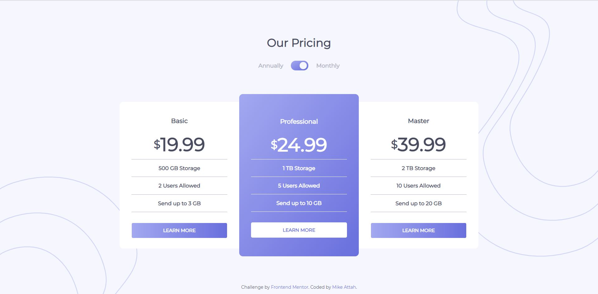

# Frontend Mentor - Pricing component with toggle solution

This is a solution to the [Pricing component with toggle challenge on Frontend Mentor](https://www.frontendmentor.io/challenges/pricing-component-with-toggle-8vPwRMIC). Frontend Mentor challenges help you improve your coding skills by building realistic projects.

## Table of contents

- [Overview](#overview)
  - [The challenge](#the-challenge)
  - [Screenshot](#screenshot)
  - [Links](#links)
- [My process](#my-process)
  - [Built with](#built-with)
  - [Continued development](#continued-development)
- [Author](#author)

## Overview

### The challenge

Users should be able to:

- View the optimal layout for the component depending on their device's screen size
- Control the toggle with both their mouse/trackpad and their keyboard
- **Bonus**: Complete the challenge with just HTML and CSS

### Screenshot

### Links

- View Submission: [Frontend Mentor](https://www.frontendmentor.io/solutions/javascript-addeventlistener-html-autofocus-css-pseudo-classes-wO_ySsos_)
- View Site: [GitHub Pages](https://mikeattah.github.io/frontend-mentor-pricing-component-with-toggle/)

## My process

### Built with

- Semantic HTML5 markup
- CSS custom properties
- Flexbox
- JavaScript

### Continued development

I will learn how to toggle innerHTML with just CSS.

## Author

- Website - [mikeattah.com](https://mikeattah.com)
- Frontend Mentor - [@mikeattah](https://www.frontendmentor.io/profile/mikeattah)
- Twitter - [@mikeattahh](https://www.twitter.com/mikeattahh)
